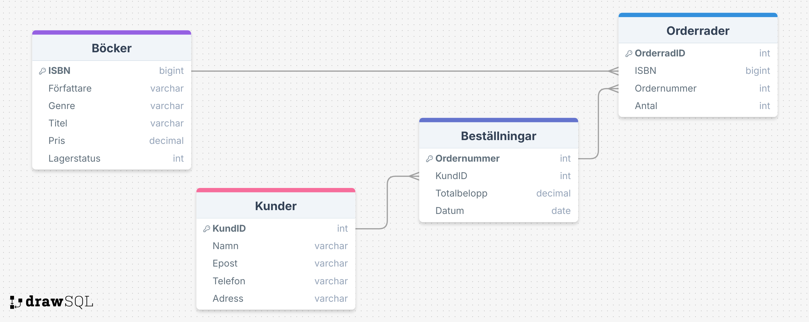

## En liten bokhandel (inlämning1) utfört av Alexander Johansson från YH25

Jag har skapat en databas till en liten bokhandel (e-handel). Här måste varje kunde ha ett konto för att lägga beställningar på olika böcker.

Relationerna gör det möjligt för kunder att (om konto finns)
* En kund kan ha flera beställningar (1–M)
* En bok kan förekomma i flera orderrader (1–M)
* En beställning kan ha flera orderrader (1–M), d.v.s flera böcker i samma beställning.

## Tabeller
* Kunder - Innehåller information om kunder (varje kund är unik)
* Beställningar - Innehåller information om kundernas beställningar
* Böcker - Innehåller olika produkter i form av böcker 
* Orderrader - Varje orderrad är unik och är kopplad till en specifik beställning samt specifik bok (ISBN)

## Vad har jag stött på under skapandet av databas-strukturen?
Jag insåg att jag hade AUTO_INCREMENT på ISBN i Bocker-tabellen, så jag ändrade det till BIGINT. Varje bok har sitt unika ISBN och därför blir det inte korrekt att auto-generera värdet.

## ER-diagram
Så här ser mitt ER-diagram ut till uppgiften:

